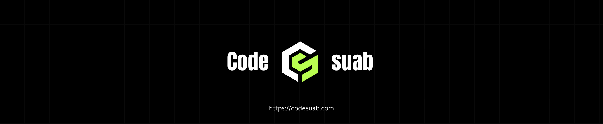

# Hello!, I'm Sahab, a fullstack Web Developer 👋🏼:
🛜 currently working on my own [codesuab](https://codesuab.com) 👨🏼‍🎓 studying computer science at National instutute in technology 👨🏼‍💻 working as a web developer since 2019</i>

# 💻 Tech Stack:
                          

###

  
  
  
  

###

<picture>
  <source media="(prefers-color-scheme: dark)" srcset="https://raw.githubusercontent.com/tobiasmeyhoefer/tobiasmeyhoefer/output/github-snake-dark.svg" />
  <source media="(prefers-color-scheme: light)" srcset="https://raw.githubusercontent.com/tobiasmeyhoefer/tobiasmeyhoefer/output/github-snake.svg" />
  
</picture>
